<p align="center">
  
</p>

# ecosystem

The **persistent semantic layer** for TAEM. A standalone service backed by Qdrant that maintains the living model of your entire infrastructure — API surfaces, mission history, constraint indices, validated wiring patterns, and operational lessons.

_"Don't mix rocket fuel with coffee."_ — Mission state lives in mc-state. Semantic knowledge lives here. Different lifecycles, different systems.

## Collections

| Collection | Owner | Purpose |
|---|---|---|
| `taem_repo_surfaces` | NAV | Live API surfaces of every repo — cache eliminates redundant reads |
| `taem_mission_memory` | kernel.mission_close | Semantic summaries of completed missions |
| `taem_constraint_index` | ARCH | All active ADR constraints as searchable vectors |
| `taem_wiring_patterns` | kernel.mission_close | Validated safe wiring patterns from LANDED missions |
| `taem_lessons_learned` | kernel.mission_close | Operational knowledge from remediation cycles and failures |

## Write Authorization

Write ownership is enforced at the HTTP handler layer per [ADR-006 C-006-002](https://github.com/TAEM-DEV/adrs/blob/main/ADR-006.yaml):

```go
var collectionWriters = map[string][]string{
    "repo_surfaces":    {"NAV"},
    "mission_memory":   {"kernel.mission_close"},
    "constraint_index": {"ARCH"},
    "wiring_patterns":  {"kernel.mission_close"},
    "lessons_learned":  {"kernel.mission_close"},
}
```

## API

```
GET  /health                              → 200 OK or 503
GET  /api/repo_surfaces/{org}/{repo}      → repo surface or 404
PUT  /api/repo_surfaces/{org}/{repo}      → write (NAV only)
GET  /api/repo_surfaces/{org}/{repo}/stale → staleness check

POST /api/mission_memory                  → write mission summary
GET  /api/mission_memory/search?q={task}  → semantic search, top-5

GET  /api/constraints/search?q={query}    → semantic constraint search
POST /api/constraints/index               → write/update (ARCH only)

GET  /api/wiring_patterns/search          → find validated patterns
POST /api/wiring_patterns                 → write validated pattern

GET  /api/lessons/search?q={task}         → semantic search, top-10
POST /api/lessons                         → write lesson
```

## How TAEM Gets Smarter

1. **NAV** caches repo surfaces → missions get faster (no redundant reads)
2. **PRB-Skeptic** queries `lessons_learned` → catches repeat failures
3. **ARCH** queries `constraint_index` semantically → finds constraints by meaning
4. **Kernel** writes validated `wiring_patterns` → proven patterns skip re-evaluation

## Running Locally

```bash
docker compose up
# ecosystem: http://localhost:8765
# qdrant:    http://localhost:6333
```

## Related Repos

| Repo | Relationship |
|---|---|
| [taem](https://github.com/TAEM-DEV/taem) | Kernel — reads from ecosystem via client |
| [adrs](https://github.com/TAEM-DEV/adrs) | ADR corpus — ARCH indexes constraints here |
| [mc-state](https://github.com/TAEM-DEV/mc-state) | Mission state — raw records (not stored here) |

## Governed By

[ADR-006 — Ecosystem Layer](https://github.com/TAEM-DEV/adrs/blob/main/ADR-006.yaml) defines all hard constraints for this service.
